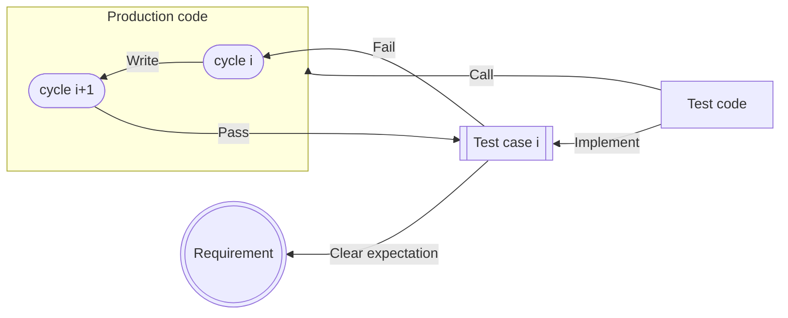

[Lab: Test-Driven Development (instructure.com)](https://tulane.instructure.com/courses/2271434/assignments/14350026)
- [[#Test-Driven Development (TDD)]]
	- [[#Three laws of TDD]]
	- [[#The Red-Green-Refactor TDD cycle]]
- [[#A Clean Test]]
	- [[#Non-clean test implementation]]
	- [[#Clean test implementation]]
- [[#JUnit]]

## Test-Driven Development (TDD)


- **Production code**: used by the running application
- **Test code**: only for the developers to verify functionalities

### Three laws of TDD
TDD is all about the **frequency of feedback**. These rules constrain us to change only one thing at a time:
1. You are not allowed to write any ==production code== unless it is to make a failing [[Lab 05 - Stacks#Unit testing|unit test]] pass.
2. You are not allowed to write any more of a ==unit test== than is sufficient to fail, and compilation failures are failures.
3. You are not allowed to write any more ==production code== than is sufficient to pass the one failing unit test.

- Each cycle:
	- pass < <ins>production code</ins> < more than sufficient to pass
	- <ins>unit test</ins> < more than sufficient to fail

### The Red-Green-Refactor TDD cycle

> [!info] TDD Cycle
> 
> More information at [Getting started • TDD Manifesto](https://tddmanifesto.com/getting-started/)


## A Clean Test
An example use-case:
- Given a shopping cart that has products with a total grand 50
- When the total grand is calculated
- Then it returns 50 as total grand

### Non-clean test implementation
```java
Test() // (1)
{
    var sc = new ShoppingCart(); // (2)
    sc.Add(new Product("id1", 10, "product 1", ProductCategory.Book)); // (3)
    sc.Add(new Product("id2", 15, "product 2", ProductCategory.Electronic));
    sc.Add(new Product("id3", 25, "product 3", ProductCategory.Hardware));
    var p = sc.Calc(); // (2)(4)
    Assert.True(p == 50);
}
```
1. Test name should be ==descriptive==
	- **GivenWhenThen**
	- **ShouldWhen**
2. Namings should be clean, ==meaningful==, and intention-revealing.
3. <ins>Hide irrelevant data</ins> for the test
	- using test data builders
4. The structure should follow the ==Arrange-Act-Assert (AAA)== pattern

### Clean test implementation
```java
GivenShoppingCartHasProductsWithTotalPrice50_whenCalculateTotalPrice_theTotalPriceIs50() // (1)
{
  // Arrange: set-up logic
  var shoppingCart = new ShoppingCart(); // (2)
  shoppingCart.Add(CreateProduct().WithPrice(10)); // (3)
  shoppingCart.Add(CreateProduct().WithPrice(15));
  shoppingCart.Add(CreateProduct().WithPrice(25));

  // Act: invokes the testing process
  var totalPrice = shoppingCart.CalculateTotalPrice(); // (2)

  // Assert: verifies the behavior
  Assert.IsEqualTo(totalPrice, 50);
}
```

#### F.I.R.S.T principle
- Fast
- Independent
- Repeatable
- Self-validating
- Thorough

## JUnit
- [JUnit 5 User Guide](https://junit.org/junit5/docs/current/user-guide/#writing-tests)
- [How to run JUnit in Eclipse?](https://junit.org/junit5/docs/current/user-guide/#running-tests-ide-eclipse)
- Common [Assertions functions](https://junit.org/junit5/docs/current/api/org.junit.jupiter.api/org/junit/jupiter/api/Assertions.html):
	- `assertTrue` / `assertFalse`
	- `assertNull` / `assertNotNull`
	- `assertEquals`