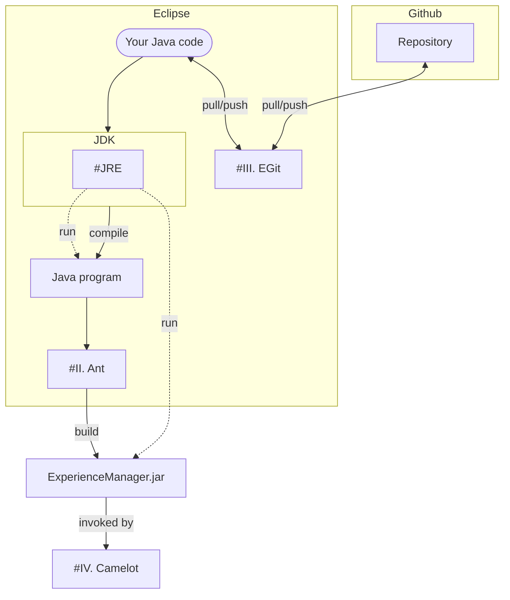

## Links
- [Assignment Description](https://tulane.instructure.com/courses/2271434/assignments/14350002)
- [Configuring Camelot](https://tulane.instructure.com/courses/2271434/pages/configuring-camelot)
- [EGit Setup](https://tulane.instructure.com/courses/2271434/pages/egit-setup)
## Overview

## I. Eclipse
### Download Eclipse
- [Eclipse Installer 2023-06 R | Eclipse Packages](https://www.eclipse.org/downloads/packages/installer)
### Install Eclipse
- Choose **Eclipse IDE for Java Developers**
  > [!note]
  > For Mac users, change the installation folder to `/Applications` if you want to launch Eclipse from Launchpad.
### Create a Hello World application
- Click "**Create a Hello World application**" on the *Welcome* page ( `Help > Welcome` ), and follow the instructions
- When creating the Java project
	- Choose "**Use default JRE**"
	- Uncheck "**Create module-info.java file**"
> [!success]
> ![[eclipse_helloworld.png]]
### JRE
- Open the shell (Terminal/Command-line/PowerShell), and run
  ```
  java --version
  ```
	- If it runs successfully, which means you have the JRE globally available, you can skip this section.
- Either install JDK from other sources:
	- [Java Downloads | Oracle](https://www.oracle.com/java/technologies/downloads/)
	- [Microsoft Build of OpenJDK](https://learn.microsoft.com/en-us/java/openjdk/install)
	- Using package manager
		- E.g., `brew install java`
- Or add an existing JRE (e.g., the one that comes with Eclipse) to the system path
  > [!note] Locate JRE directory in Eclipse
  > Navigate to **Preferences** (Windows: `Window > Preferences`; macOS: `Eclipse > Settings...`) `> Java > Installed JREs`

  add `<JRE_home>/bin` to PATH
	- [How to Add to Windows PATH Environment Variable (helpdeskgeek.com)](https://helpdeskgeek.com/windows-10/add-windows-path-environment-variable/)
	- [How to add a directory to system path on macos? - Search (bing.com)](https://www.bing.com/search?q=How+to+add+a+directory+to+system+path+on+macos%3F&qs=n&form=QBRE&sp=-1&lq=0&pq=how+to+add+a+directory+to+system+path+on+macos%3F&sc=1-47&sk=&cvid=4378818048944D8F80C258137169AB12&ghsh=0&ghacc=0&ghpl=)
#### Using an existing JRE for Eclipse
- Add and apply JRE (see the section above)
- Change _compiler compliance level_ (`Preferences > Java > Compiler`) accordingly
## II. Ant
### Import existing Java projects
- Download the [course project](https://tulane.instructure.com/courses/2271434/pages/java-project)
- [Import it to into Eclipse workspace](https://www.codejava.net/ides/eclipse/import-existing-projects-into-eclipse-workspace)
### Configure Ant Builder
> [!note]
> The [course project](https://tulane.instructure.com/courses/2271434/pages/java-project) has been properly configured.

> [!info]
> See [Configure Ant to build Jar file](https://tulane.instructure.com/courses/2271434/pages/build-dot-xml) for reference.
## III. EGit
> [!info]
> See [EGit Setup](https://tulane.instructure.com/courses/2271434/pages/egit-setup) for reference.
### Prerequisite
- A [GitHub](https://github.com/) account
- A [repository](https://github.com/new) in your account
### Generate a personal access token
- Go to the [setting page](https://github.com/settings/personal-access-tokens/new).
  ![[github_generate_PAT.png]]
- Repository access
	- choose **Only select repositories**
- Permissions > Repository permissions (Access: Read and write)
	- Commit statuses
	- Contents
	- Discussions
	- Issues
	- Pull requests
### Clone repository
- Open the Git window
  ![[egit_window.png]]
	- If the **Git** icon is not shown on the toolbar, click the **Open Perspective** icon in the top right corner to add it
- Clone Git Repository
	- URI: the HTTPS link to your repo
	- User: your Github user name
	- Password: the access token generated in [[Lab 00 - Project Setup#[Generate a personal access token](https //github.com/settings/personal-access-tokens/new)|the section above]] 
## IV. Camelot
> [!info]
> See [Configuring Camelot](https://tulane.instructure.com/courses/2271434/pages/configuring-camelot) for reference.
### Windows
- Download [Camelot](http://cs.uky.edu/~sgware/projects/camelot/v1-2/) and extract it to your preferred location
### MacOS
- Download the app from [here](https://drive.google.com/drive/folders/1iiD872kNDVB_G3Vk3O55cdb79iMAvGzI)(whole folder)
  ![[camelot_downloading_macos.png|500]]
- Locate the downloaded zip file (move it to your preferred location if you wish) and double-click it to extract it(e.g., at `~/Downloads/Camelot.app`)
- Open terminal at the app folder
  ![[macos_open_terminal.png|240]]
	- Change directory to the parent folder
    ```sh
    cd ..
    ```
	- Give execution permission to `Camelot.app`
    ```sh
    chmod -R +x Camelot.app
    ```
	- Change system policies (enter admin password when prompted) to allow applications downloaded from anywhere
    ```sh
    sudo spctl --master-disable
    ```
	![[macos_app_anywhere.png|400]]
	- Remove all extended attributes from the app
    ```sh
	xattr -cr Camelot.app
    ```
  ![[camelot_macos_setup.png|600]]
- Create a text file with name `StartExperienceManager.sh` at the same directory (Here, we are using TextEdit as an example, but you are free to use any editor you prefer)
  ```sh
  open -a TextEdit StartExperienceManager.sh
  ```
  and edit it with the <ins>full path</ins> (e.g., `"/Users/username/Downloads/ManualExperienceManager.jar"`) of a required [`jar` file](https://tulane.instructure.com/courses/2271434/files/116767362)
  ```sh
  java -jar "/Full/Path/To/Your/JarFile.jar"
  ```
  ![[macos_get_full_path.png|320]]
### Launch Camelot
- Open Camelot ![[PlayerIcon.png|40]]
	- Enter `ShowMenu` in `Experience Manager`
	  ![[camelot_showmenu.png|400]]
> [!success]
> ![[camelot_start_screen.png|480]]
